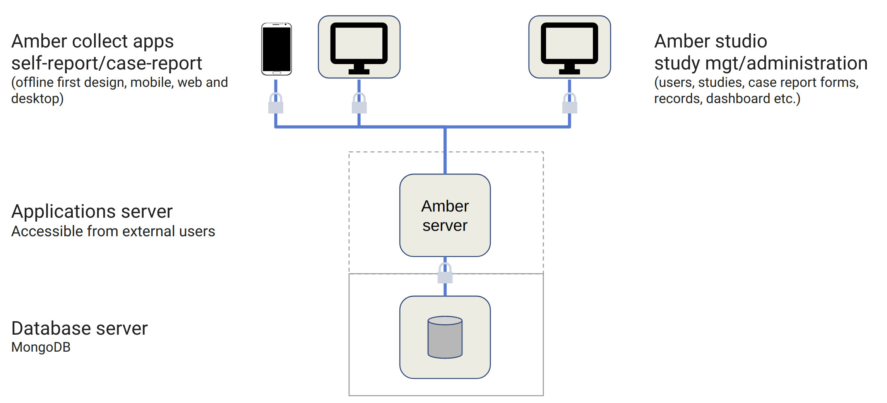

Introduction
============

Amber is a web-based applications system for collecting case reports data based on forms. This system is composed of the Amber Server application and of several frontend applications with different purposes (content administration or data collection). Amber is designed to ensure that data is collected in an automated, efficient and secure way in order to minimize human errors. Forms can be designed, internationalized and revised without requiring programming skills.

The diagram below illustrates the relationships between the Amber server and the other frontend applications:

Amber Server
------------

The Amber Server engine is in charge of the core logic, data storage and access controls:

* **Web services API**: all Amber functionalities are available through web services allowing various usage from multiple client applications.
* **Authentication**: signin, signup, password recovery, email validation, two-factor authentication, access token with inactivaty and expiration timeouts.
* **Authorization**: role-based and access control lists.
* **Database encryption**: critical content (individual records) are encrypted in the database.
* **Scalable**: multiple server instances can be deployed with a load balancer to support heavy usage.

Amber Studio
------------

Amber Studio is a web application for managing Amber system content:

* **Dashboard**: basic activity metrics.
* **User/groups management**: add/delete/validate users, assign roles, grant specific permissions.
* **Studies**: basically a group of forms and records.
* **Form builder**: create new forms with a user-friendly interface and minimal programming. Multi-languages and left-right support. Rich form items: choices, open text entries, dropdowns, image selection, autocomplete, sliders, ratings, geographic features (points, lines, polygons) and more. Complex forms can be handled with skip logic, data validation and computed fields.
* **Form version control**: modify forms without interfering with on-going data collection. Always associate a record with the form revision used. Safely revert to a previous revision.
* **Form import/export**: export the complete form design and import it in another Amber system.
* **Case report form access control**: enable a CRF and restrict its access to specific users/groups.
* **Case report records**: filter records (by date, form and revision), visualize and modify them afterwards. Export in multiple formats (CSV, Excel, JSON), including full data dictionary as converted from the form.

Amber Collect
-------------

Amber Collect is a web application for collecting case reports:

* **Secure**: authentication is required and authorizations apply. Two-factor authentication is supported.
* **Efficient**: interface is deliberatly minimal to focus on data collection.
* **Multi-languages**: when the form is designed in several languages, the user can easily switch to another language, with the corresponding character set and left-right layout is automatically detected and applied.
* **Offline-first design**: in case the network in not accessible, collected data are stored encrypted locally. When connection is restored, data are automatically sent to the Amber Server for permanent storage.
* **Progressive web app**: a PWA is an installable web application, facilitating its deployment on mobile devices (no app store required). See `What are Progressive Web Apps? <https://web.dev/what-are-pwas/>`_.
