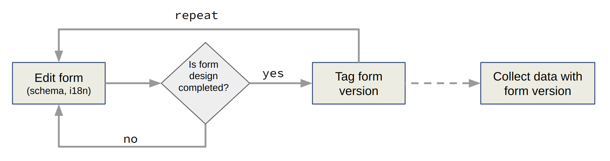

.. _forms:

Forms
=====

The forms are the heart of Amber. A form describes how the data will be collected, with a built-in support for multilanguage. The form's **schema** is made of:

* **Items**, which can be data input fields, structural items (group, section) or computed fields.
* **Translations**, which is a list of translation keys with values for each language.

Different versions of a form can be saved, which allows to safely edit a form while a version is used for data capture. Form versions also ensure that the data collected are properly described by the form that was used to collected them, avoiding variable renaming errors, options addition/removal conflicts, changes in the labels which could affect the question semantic etc.

List of forms
-------------

From the list of forms the following operations are available:

Add a form
~~~~~~~~~~

When creating a form, a name is required, a description is optional. This purely informative for management purpose and will not appear when the form is administered.

It is possible to prepopulate the form with a schema, that was previously exported from another form. This is optional and can also be done later.

Delete form(s)
~~~~~~~~~~~~~~~~~

To delete several forms:

* Select one or more forms in the list,
* Press the Delete selected forms button and confirm.

You can also delete a specific form by pressing the form's Delete action button.

Single form
------------

To navigate to a form page, click on the form's name or the pencil icon. The page that is opened has two tabs:

* The schema tab, with a form item's builder and translations editor,
* The list of the form's versions.

Export
~~~~~~

Export the form's schema in text file (JSON format). Advanced users can edit this file, which can be convenient for the translations section for instance.

Import
~~~~~~

Import a previously exported form schema. This operation will replace the whole tree of items and the translations.

Tag
~~~

Creates a new form revision. Giving a comment that describes the changes in the form is recommended.

Items
~~~~~

The form items is a tree which root is the form itself.

The following form item types are available:

========================== =============== ========================================
Type                       Category        Description
========================== =============== ========================================
:ref:`auto_complete`       Select          Select a single or multiple values by filtering a (long) list of options.
:ref:`dropdown`            Select          Select a single or multiple values in a menu.
:ref:`image_select`        Select          Select a single or multiple areas on an image.
:ref:`multiple_choices`    Select          Checkbox choices.
:ref:`single_choice`       Select          Radio choices.
:ref:`date`                Temporal        Date value, in ``yyyy-MM-dd`` format (ISO 8601).
:ref:`datetime`            Temporal        Date and time value, in ``yyyy-MM-dd mm:ss`` format (ISO 8601).
:ref:`time`                Temporal        Time value, in ``mm:ss`` format.
:ref:`geo_data`            Geographic      Select a single or multiple geographic features (point or polygon).
:ref:`number`              Number          Input field with numeric value.
:ref:`rating`              Number          Gradual numeric values, rendered as icons.
:ref:`slider`              Number          Gradual numeric values, rendered as a slider.
:ref:`paragraph`           Text            Long text.
:ref:`short_answer`        Text            Short text.
:ref:`group`               Structure       Group one or more items.
:ref:`section`             Structure       Information text.
:ref:`toggle`              Logical         True or False.
:ref:`computed`            Other           Not visible, data is computed with the other item's data.
========================== =============== ========================================

The following definition settings are common to all items:

================== ====================================
Setting            Description
================== ====================================
``Type``           The type of item (see above).
``Name``           The name of the item is not visible: it will be associated to the data collected.
``Label``          The label is usually a question or a title.
``Description``    The description gives some guidance about how to enter data, what are there meaning etc.
``Required``       Whether an input is mandatory (does not apply to structural items such as Group and Section).
================== ====================================

Some settings are expressed by a script which is evaluated at each data entry.

================== ====================================
Setting            Description
================== ====================================
``Condition``      The condition makes an item visible or not depending of other data. It is a small script which returns a logical value. True when item is visible.
``Validation``     True when item value is valid. Does not apply to items not capturing data (such as :ref:`group` or :ref:`section`).
================== ====================================

The scripting language is Javascript. It allows to express complex logic with a single line. See detailed explanations:

* :ref:`cb_condition`
* :ref:`cb_validation`

Translations
~~~~~~~~~~~~
