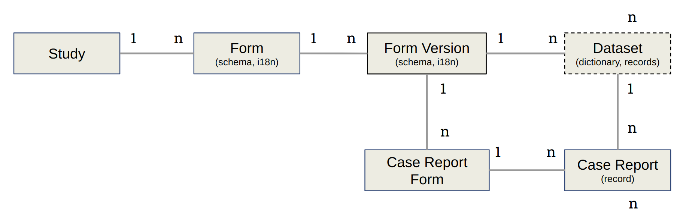

Content
=======

This section is where the studies are designed and from where the data records will be extracted. It is not accessible to ``Guest`` users, accessible read-only to ``Interviewer`` users, and editable by ``Manager`` and ``Administrator`` users.

The Amber data model is the following:

* A **Study** has **Forms**,
* A **Form** has a schema (the description of fields/items, with multilanguage support) and associated **Form versions**,
* A **Case Report Form** describes the context of data collection with a **Form version**,
* A **Case Report** is a record of data that were captured using a **Case Report Form**.

An extraction of records constitutes a **Dataset**, i.e. a synthesis of a data dictionary (built from the Form schema, in a specific version) and the data (the records).

.. toctree::
   :maxdepth: 2

   studies
   forms
   crfs
   records
