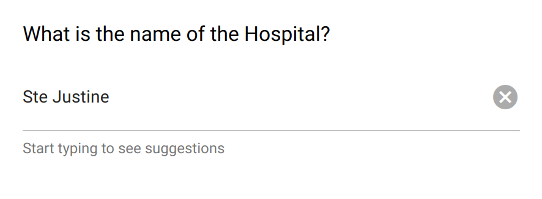

.. _auto_complete:

Auto Complete
=============

The auto complete field captures a text or a list of texts. It has some "options", i.e. possible values that are proposed for selection after typing a few characters (at least two). It is also possible to use these options as suggestions only and allow entering new values.

This field is appropriate when there is a long list of options (place names for instance) and for reducing text variations with an open field.

Preview
-------

  The auto complete field helps with the formatting of open text entries.

Design
------

Definition
~~~~~~~~~~

.. include:: common-definition.rst
.. include:: common-scripts.rst

Settings
~~~~~~~~

.. list-table::
   :widths: 10 90
   :header-rows: 1

   * - Property
     - Definition
   * - ``Hint``
     - Help text below the input field.
   * - ``Default``
     - The default value. Only a single value can be specified, even when ``Multiple choices`` is set.
   * - ``Multiple choices``
     - When selected, the captured data is a list of texts. Default is ``false``, i.e. a single value is captured.
   * - ``Options``
     - The list of predefined values, either to be selected or used as suggestions. For provisioning a lot of options, see :ref:`cb_large_select`
   * - ``Can enter new value``
     - When selected, an entry that is not in the list of options can be added. Default is ``false``, i.e. a valid entry must be one of the options.

Style
~~~~~

.. list-table::
   :widths: 10 90
   :header-rows: 1

   * - Property
     - Definition
   * - ``Label class``
     - CSS class to apply to the field label. See :ref:`cb_style`
