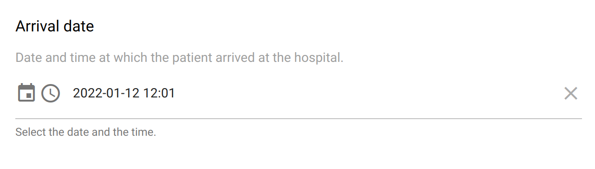
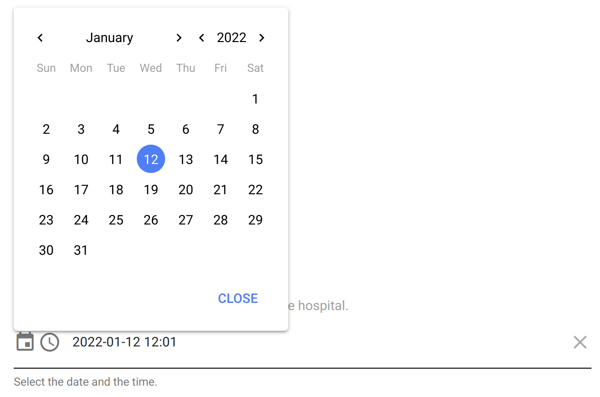
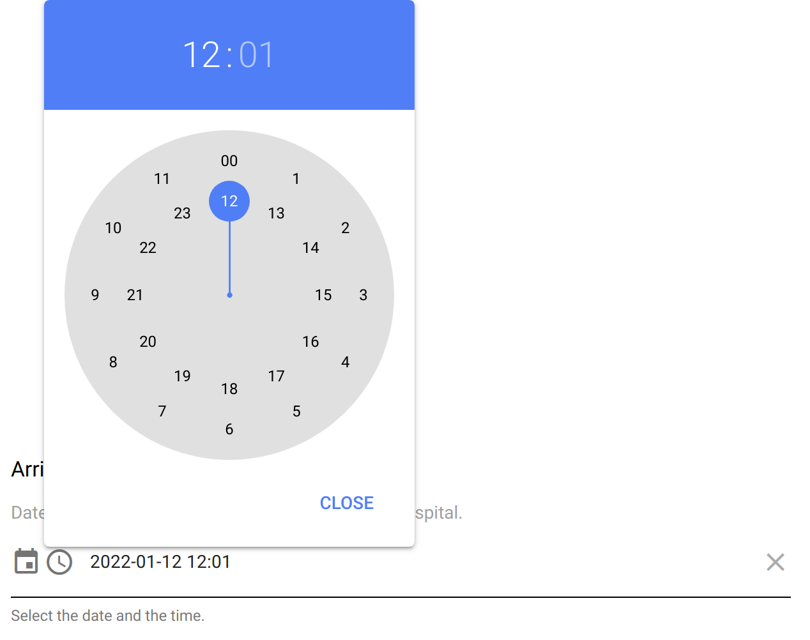

.. _datetime:

Date and Time
=============

This field is for capturing a date and time value. It is expressed as a string in ISO 8601 format: ``yyyy-MM-dd hh:mm`` (4 digits year, 2 digits month, 2 digits day, 2 digits hour, 2 digits minutes).

Preview
-------

  The date field is in ISO 8601 format.

  The date selector allows to navigate in the years/months. The close button can be translated.

  The time selector allows to select the hour and minutes in the day. The close button can be translated.

Design
------

Definition
~~~~~~~~~~

.. include:: common-definition.rst
.. include:: common-scripts.rst

Settings
~~~~~~~~

.. list-table::
   :widths: 10 90
   :header-rows: 1

   * - Property
     - Definition
   * - ``Hint``
     - Help text below the input field.
   * - ``Close``
     - The close button's label. Use a translation key when you want to have it in several languages.
   * - ``Default``
     - The default value. Make sure it is in the right format.

Style
~~~~~

.. include:: common-style.rst
