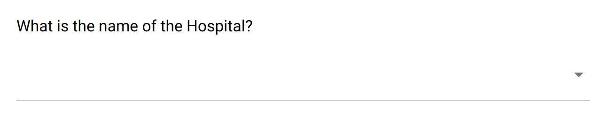

.. _dropdown:

Dropdown
========

The dropdown field captures a text or a list of texts. It has some "options", i.e. possible values that are proposed in a dropdown menu.

This is the appropriate field for a compact rending of choices (as opposed to :ref:`single_choice` or :ref:`multiple_choices` fields), and when there are not too much options (see the :ref:`auto_complete` field).

Preview
-------

  The dropdown field proposes a list of choices to select in a menu.

Design
------

Definition
~~~~~~~~~~

.. include:: common-definition.rst
.. include:: common-scripts.rst

Settings
~~~~~~~~

.. list-table::
   :widths: 10 90
   :header-rows: 1

   * - Property
     - Definition
   * - ``Hint``
     - Help text below the input field.
   * - ``Default``
     - The default value. Only a single value can be specified, even when ``Multiple choices`` is set.
   * - ``Multiple choices``
     - When selected, the captured data is a list of texts. Default is ``false``, i.e. a single value is captured.
   * - ``Options``
     - The list of predefined values, either to be selected or used as suggestions. For provisioning a lot of options, see :ref:`cb_large_select`

Style
~~~~~

.. include:: common-style.rst
