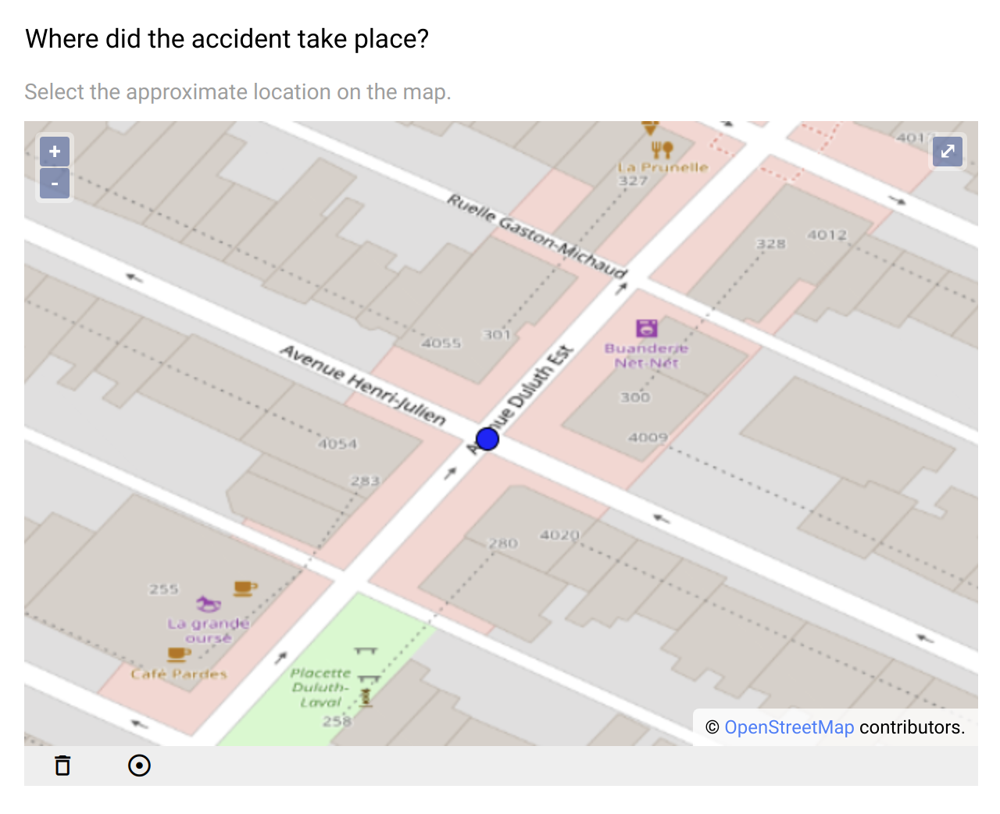
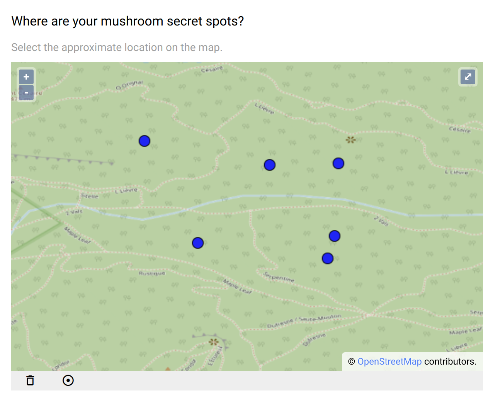
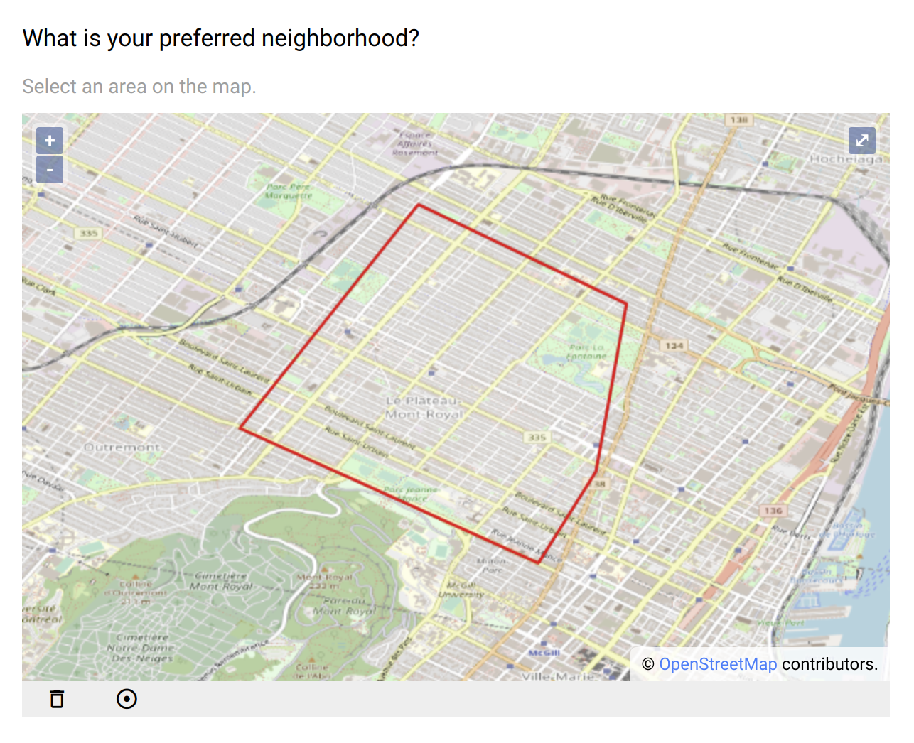

.. _geo_data:

Geographic data
===============

Geographic data can be of different type: a point (single location) or a polygon (area). This field captures such geometric features in `GeoSON <https://geojson.org/>`_ format. It is possible to capture multiple geographic data (of the same type).

Preview
-------

Some controls are available on the map:

* the +/- buttons to zoom in/out,
* the fullscreen button,
* the trash icon to delete all the selections,
* the target icon to center the map.

  Single location selection on the map.

  Multiple locations selection on the map.

  Selection of an area on the map.

Example of geographic data (a point in GeoJSON format):

.. code-block:: json

   {
      "type": "Feature",
      "geometry": {
        "type": "Point",
        "coordinates": [
          -74.18465727715618,
          46.03587230951427
        ]
      },
      "properties": null
   }

Design
------

Definition
~~~~~~~~~~

.. include:: common-definition.rst
.. include:: common-scripts.rst

Settings
~~~~~~~~

.. list-table::
  :widths: 10 90
  :header-rows: 1

  * - Property
    - Definition
  * - ``Default``
    - The default value. When ``Multiple choices`` is set, an array of GeoJSON objects is expected, otherwise a single GeoJSON can be provided.
  * - ``Geometery type``
    - As per the GeoJSON standard: `Point` or `Polygon`.
  * - ``Map center``
    - | Position of the center of the map, using format: **[longitude,latitude]**. Default is ``[0,0]``. When clicking on the target icon, the map will be repositioned at that location. 
      | If the geo location is activated, the starting point will be the map center, then the current position as reported by the device will be used.
  * - ``Zoom``
    - Zoom to apply when the map center is defined.
  * - ``With geo location``
    - The device will report the current position (usually a combination of positions from GPS, mobile network, internet entry point).
  * - ``Multiple choices``
    - When selected, the captured data is a list of geometric features. Default is ``false``, i.e. a single value is captured.

Style
~~~~~

.. include:: common-style.rst
