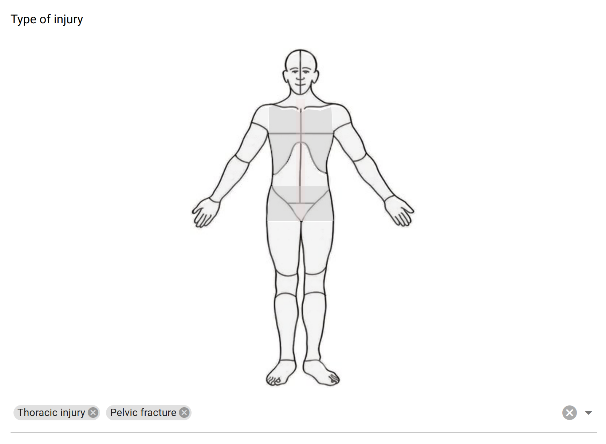

.. _image_select:

Image Select
============

The dropdown field captures a text or a list of texts. It has some "options", i.e. possible values that are proposed in a dropdown menu. In addition to these options, an image is to be defined, with some clickable areas. Each image area triggers an option selection. Selecting an option also highlights the corresponding image area.

This field is recommended for having a graphical representation of the options to select. The image can be accessed via an URL or embedded in the form (convenient for offline usage).

Preview
-------

  The image select field proposes a clickable image and (optionally) a list of choices to select in a menu.

Design
------

Definition
~~~~~~~~~~

.. include:: common-definition.rst
.. include:: common-scripts.rst

Settings
~~~~~~~~

.. list-table::
   :widths: 10 90
   :header-rows: 1

   * - Property
     - Definition
   * - ``Hint``
     - Help text below the input field.
   * - ``Default``
     - The default value. Only a single value can be specified, even when ``Multiple choices`` is set.
   * - ``Multiple choices``
     - When selected, the captured data is a list of texts. Default is ``false``, i.e. a single value is captured.
   * - ``Options``
     - The list of predefined values, either to be selected or used as suggestions. For provisioning a lot of options, see :ref:`cb_large_select`
   * - ``Show options selection widget``
     - The dropdown menu with the options can be hidden. By default it is visible.

Image
~~~~~

.. list-table::
   :widths: 10 90
   :header-rows: 1

   * - Property
     - Definition
   * - ``Image source``
     - | The image source can be a link to an image available on the internet (requires network access).
       | It can also be embedded within the form in base64 format. To help with this operation, the ``Upload image`` field can be used:
       | select a file (``.jpg`` or ``.png``), and the image source will be automatically filled in.
   * - ``Image areas``
     - | An image area is composed of: a value (the data collected, which must match an option's value),
       | a color (opacity will change when area is selected) and a list of points. Several areas can select the same value.
       | Points are space-separated x,y coordinates and are describing a polygon shape (rectangle and circle shapes are not supported).
       | To help with the area coordinates design, some image map tools are avaliable online (for instance `Image Map Generator <https://www.image-map.net/>`_).
       | These areas can be defined in a CSV (comma separated) or TSV (tab separated) file and uploaded.
       | See details and examples in :ref:`cb_image_map`

Style
~~~~~

.. list-table::
   :widths: 10 90
   :header-rows: 1

   * - Property
     - Definition
   * - ``Label class``
     - CSS class to apply to the field label. See :ref:`cb_style`
   * - ``Image class``
     - CSS class to apply to the image. For instance the image can be centered using ``text-center``.
