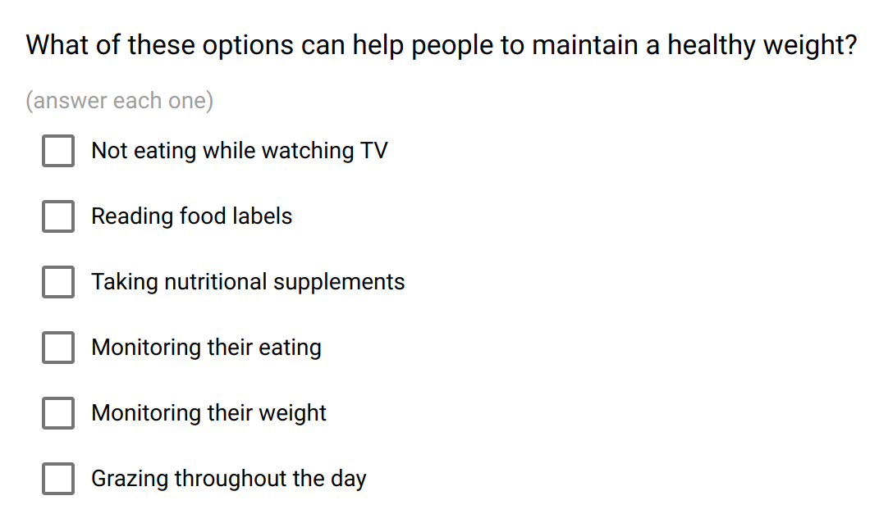

.. _multiple_choices:

Multiple Choices
================

The multiple choices item is for selecting a list of texts. It has some "options", i.e. possible values that are proposed with checkboxes.

This is the appropriate field for having the choices immediately visible (as opposed to :ref:`dropdown` or :ref:`auto_complete` fields), and when there are not too much options.

Preview
-------

  The multiple choices field proposes a list of choices to select.

Design
------

Definition
~~~~~~~~~~

.. include:: common-definition.rst
.. include:: common-scripts.rst

Settings
~~~~~~~~

.. list-table::
   :widths: 10 90
   :header-rows: 1

   * - Property
     - Definition
   * - ``Default``
     - The default value. A single value can be specified, or an array of values (for instance, for selecting 1 and 3, enter default value ``["1","3"]``).
   * - ``Options``
     - The list of predefined values to be selected. For provisioning a lot of options, see :ref:`cb_large_select`

Style
~~~~~

.. include:: common-style.rst
