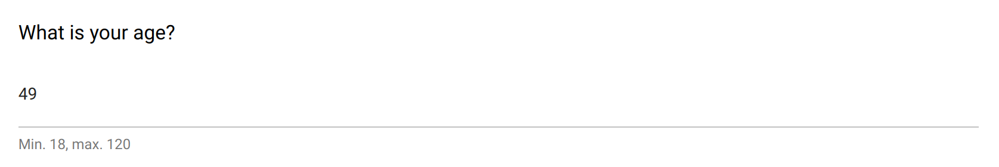

.. _number:

Number
======

This item is for capturing a number value, with a standard input field. There is no restriction regarding the number value that can be entered: one should specify some ``Validation`` rule in order to ensure the number is in a valid range and/or is an integer vs. float number.

See also the :ref:`slider` or :ref:`rating` items to get more control on the data entry.

Preview
-------

  The number field using standard input.

Design
------

Definition
~~~~~~~~~~

.. include:: common-definition.rst
.. include:: common-scripts.rst

Settings
~~~~~~~~

.. list-table::
   :widths: 10 90
   :header-rows: 1

   * - Property
     - Definition
   * - ``Hint``
     - Help text below the input field.
   * - ``Default``
     - The default value. Make sure it is in the right format.

Style
~~~~~

.. include:: common-style.rst
