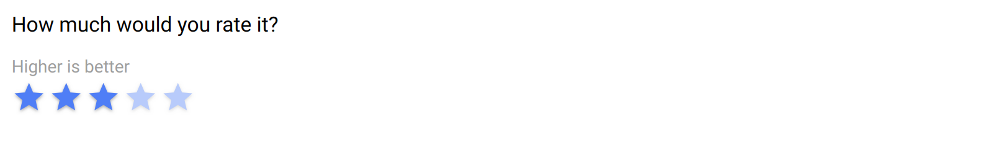

.. _rating:

Rating
======

This item is for capturing a number value, on a scale starting from 1.

See also the :ref:`slider` item when the range of values is large.

Preview
-------

  The rating field consists of selecting icons.

Design
------

Definition
~~~~~~~~~~

.. include:: common-definition.rst
.. include:: common-scripts.rst

Settings
~~~~~~~~

.. list-table::
   :widths: 10 90
   :header-rows: 1

   * - Property
     - Definition
   * - ``Default``
     - The default value. Make sure it is in the right format.
   * - ``Maximum``
     - Maximum possible value (starting from 1).

Style
~~~~~

.. list-table::
   :widths: 10 90
   :header-rows: 1

   * - Property
     - Definition
   * - ``Label class``
     - CSS class to apply to the field label. See :ref:`cb_style`
   * - ``Icon``
     - The name of the `Material Icon <https://fonts.google.com/icons?selected=Material+Icons>`_ to display. Default is ``star``.
   * - ``Size``
     - Size of the icon in CSS units, including unit name or standard size name (xs|sm|md|lg|xl). Examples: ``16px``, ``2rem``, ``xs``, ``md``.
   * - ``Color``
     - Color name in the `color palette <https://quasar.dev/style/color-palette>`_.
