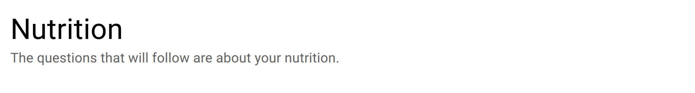

.. _section:

Section
=======

The section item is a structural item: it does not collect any data. As a consequence, this item will not appear in the exported data dictionary.

This item is appropriate for separating items in different sections. See also :ref:`group`.

Preview
-------

  The section is a title followed by a paragraph.

Design
------

Definition
~~~~~~~~~~

.. list-table::
   :widths: 10 90
   :header-rows: 1

   * - Property
     - Definition
   * - ``Type``
     - The type of item (see above).
   * - ``Name``
     - The name of the section is not visible.
   * - ``Label``
     - The label is usually a question or a title.
   * - ``Description``
     - The description gives some guidance about how to enter data, what are their meaning etc.
   * - ``Condition``
     - | The condition makes the section visible or not, depending of other data. It is a small script which returns a logical value: ``true`` when item is visible.
       | When no condition is specified (which is the default), the section is visible.
       | See :ref:`cb_condition`

Style
~~~~~

.. list-table::
   :widths: 10 90
   :header-rows: 1

   * - Property
     - Definition
   * - ``Label class``
     - CSS class to apply to the section title. Default is ``text-h4``. See :ref:`cb_style`
   * - ``Description class``
     - CSS class to apply to the section description. Default is ``text-subtitle1 text-grey-8``.
