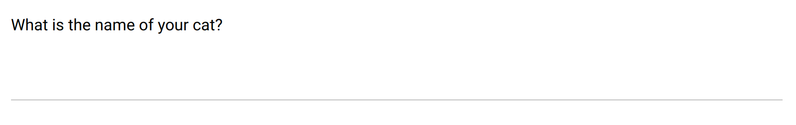

.. _short_answer:

Short Answer
============

This item is for capturing a short text (one line), with a standard input field. See also the :ref:`paragraph`.

Preview
-------

  The short text field using standard input.

Design
------

Definition
~~~~~~~~~~

.. include:: common-definition.rst
.. include:: common-scripts.rst

Settings
~~~~~~~~

.. list-table::
   :widths: 10 90
   :header-rows: 1

   * - Property
     - Definition
   * - ``Placeholder``
     - Example text included in the text area when it is empty.
   * - ``Hint``
     - Help text below the input field.
   * - ``Default``
     - The default value. Make sure it is in the right format.

Style
~~~~~

.. include:: common-style.rst
