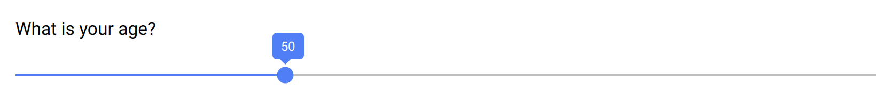

.. _slider:

Slider
======

This item is for capturing a number value, with a slider widget.

See also the :ref:`rating` item to get a scale entry.

Preview
-------

  The number field using a slider widget.

Design
------

Definition
~~~~~~~~~~

.. include:: common-definition.rst
.. include:: common-scripts.rst

Settings
~~~~~~~~

.. list-table::
   :widths: 10 90
   :header-rows: 1

   * - Property
     - Definition
   * - ``Default``
     - The default value. Make sure it is in the right format.
   * - ``Minimum``
     - Minimum value of the range (inclusive).
   * - ``Maximum``
     - Maximum value of the range (inclusive).

Style
~~~~~

.. include:: common-style.rst
