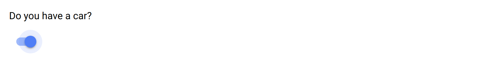

.. _toggle:

Toggle
======

The toggle item is for capturing a logical value. The toggle has three states: selected, not selected and undefined. The undefined state is when the user has not made a choice yet. Only selected and not selected states can be chosen.

This field can be an alternative to a yes/no :ref:`single_choice` question.

Preview
-------

  The toggle field widget.

Design
------

Definition
~~~~~~~~~~

.. include:: common-definition.rst
.. include:: common-scripts.rst

Settings
~~~~~~~~

.. list-table::
   :widths: 10 90
   :header-rows: 1

   * - Property
     - Definition
   * - ``Default``
     - The default value: either ``true`` or ``false``.

Style
~~~~~

.. include:: common-style.rst
